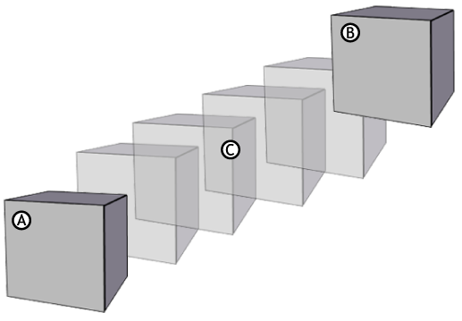
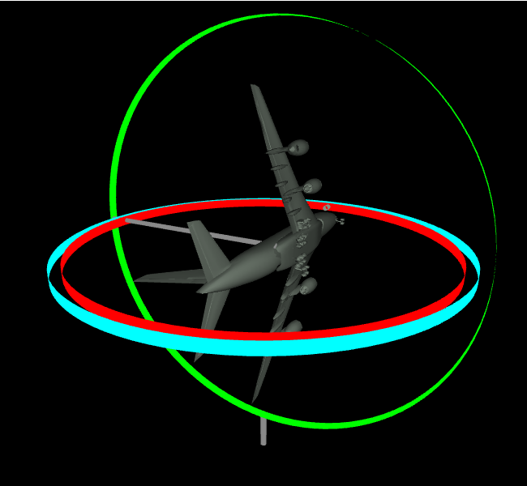
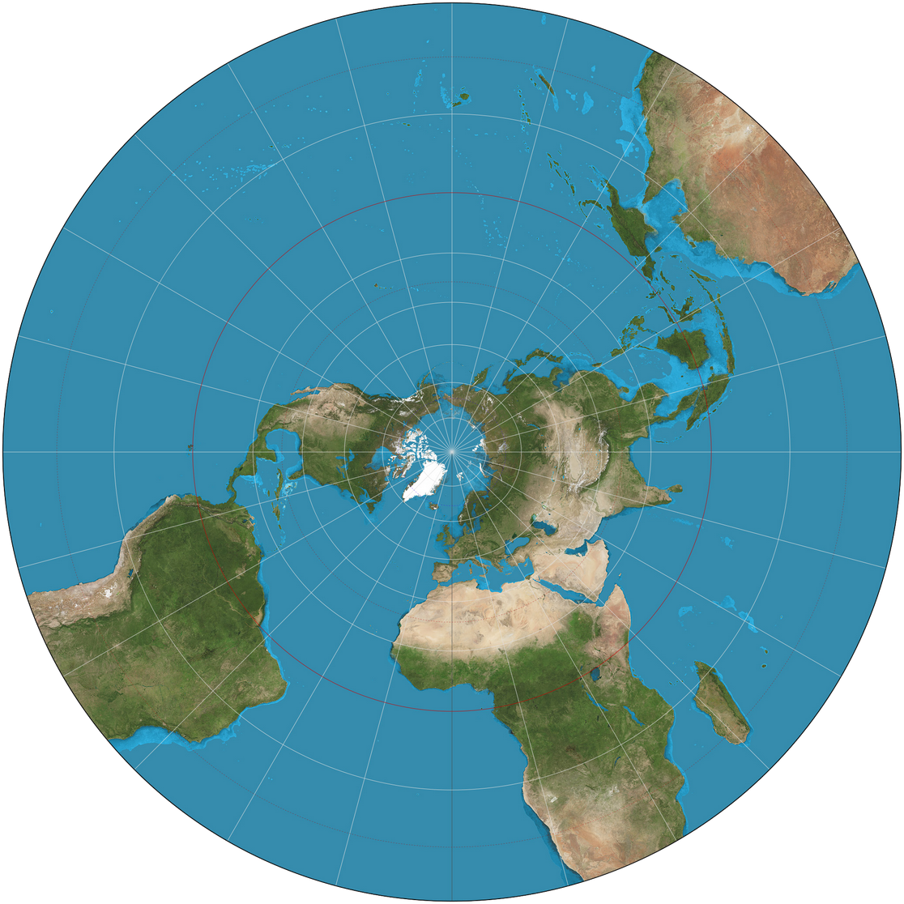
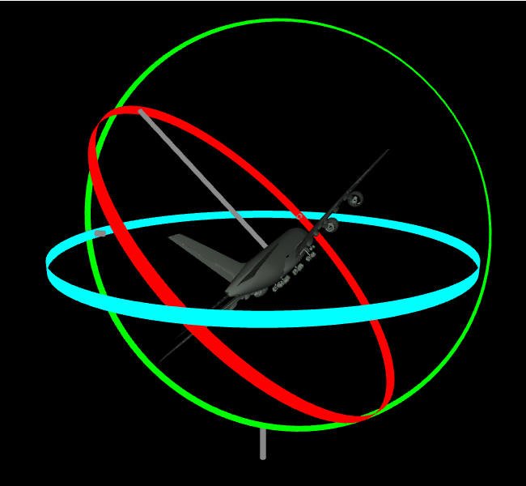
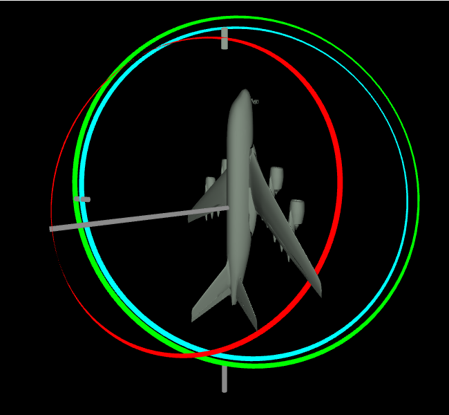

# Abstract

In this paper, we explore the mathematical and computational methods
used to represent and perform rotations in 3D simulations, with a focus
on Euler rotations and quaternions. We begin by introducing Euler
rotations, a commonly used and intuitive system for representing 3D
orientations based on pitch, yaw, and bank. However, we also address the
inherent limitations of Euler rotations, such as gimbal lock, which
restricts smooth interpolation between orientations.

To overcome these limitations, we delve into quaternions, a powerful
mathematical tool for representing 3D rotations. Quaternions offer
advantages such as gimbal-lock-free interpolation, computational
efficiency, and robustness. We describe quaternion properties, including
negation, magnitude, conjugate, inverse, and non-commutative
multiplication. The process of converting between Euler angles, rotation
matrices, and quaternions is detailed with practical examples,
illustrating the advantages of quaternions in 3D simulations.

Finally, we present spherical linear interpolation (SLERP) as a
technique for interpolating between two quaternions, enabling smooth
transitions in animations and simulations. Through step-by-step
calculations and examples, we demonstrate how quaternion-based rotations
provide a more efficient and versatile approach to 3D transformations
compared to traditional Euler rotations.

# Introduction

Rotations are fundamental in 3D simulations, enabling realistic
movement, orientation, and interaction within virtual environments. From
video games to animations and robotics, understanding and implementing
rotational transformations is a cornerstone of 3D graphics and physics
simulations. However, achieving precise and efficient rotations requires
leveraging mathematical representations that are both computationally
effective and free from common pitfalls such as loss of degrees of
freedom or interpolation difficulties. We go through the popular choice
of rotation systems Euler rotations and it's pros and cons. and show off
quaternions and why they are used despite their complexity in dealing
with 4D objects and complex numbers. After we go through show how a
rotation is done in an actual 3d simulation.

# Euler Rotations

To understand rotations in 3d space it is important to understand Euler
Rotations which operates in 3 axis pitch, yaw, backing \* . Each of
these can represent the axis x,y,z and any rotation can be described
with these three components where each component represents the rotation
on a 2d axis. A way to think of this is a gimbal, used for cameras in
film they are a contraption of 3 circles each smaller than with each
resting inside the bigger one, each one representing an axis. Euler is a
system that compared to other systems is intuitive for us to
understand.\
\
The math for Euler rotations uses a matrix for each axis or rotation
where $B$, $P$, and $H$ are the rotation matrices for bank, pitch, and
heading, which rotate about the $z$-, $x$-, and $y$-axes, respectively.:

$$B = R_z(b) = \begin{bmatrix}
    \cos b & \sin b & 0 \\
    -\sin b & \cos b & 0 \\
    0 & 0 & 1
    \end{bmatrix}, \quad$$ $$P = R_x(p) = \begin{bmatrix}
    1 & 0 & 0 \\
    0 & \cos p & \sin p \\
    0 & -\sin p & \cos p
    \end{bmatrix}, \quad$$ $$H = R_y(h) = \begin{bmatrix}
    \cos h & 0 & \sin h \\
    0 & 1 & 0 \\
    -\sin h & 0 & \cos h
    \end{bmatrix}$$

multiplying the three matrices together we get:

$$\begin{bmatrix}
    \cos h \cdot \cos b + \sin h \cdot \sin p \cdot \sin b & -\cos h \cdot \sin b + \sin h \cdot \sin p \cdot \cos b & \sin h \cdot \cos p \\
    \sin b \cdot \cos p & \cos b \cdot \cos p & -\sin p \\
    -\sin h \cdot \cos b + \cos h \cdot \sin p \cdot \sin b & \sin b \cdot \sin h + \cos h \cdot \sin p \cdot \cos b & \cos h \cdot \cos p
    \end{bmatrix}$$

Using Euler representations there are no limitations in being able to
rotate to a different orientation from another. However, when wanting to
interpolate between two orientations, there exists a specific
orientation that can where Euler cannot smoothly interpolate between
orientations, this is called Gimbal Lock.

# Gimbal Lock

Gimbal lock is a limitation of Euler rotations when interpolating
between two orientations, when you have two orientations that you want
to get an object from one to another, interpolation is the ability to be
able to create every step rotation from the original orientation to the
new orientation.\
To visualize interpolation it can be useful to think of a 3d object
rotation, the start and end of the rotation are the beginning
orientation and end orientation and the interpolations are all the sub
rotations between those two orientations.

::: center
{width="50%"}
:::

Interpolation is the main advantage of 3d animation vs 2d animation.
because in 3d animation the computer has a model for you to manipulate,
ideally you don't have to tell it what to do every step of the way
compared to 2d animation where you must create every frame. As such
these issues are very relevant when creating 3d environments for artists
to work in. Back to the gimbal lock, now a 3d simulation created with
Euler representations internally will run into gimbal lock specifically
when two axis' align which becomes an issue because you lose a degree of
rotation which requires a series of rotations to get out of the gimbal
lock.

::: center
{width="50%"}
:::

What this means is when you try to interpolate while a gimbal is in
gimbal lock you the rotation will take a non direct path because it is
trying to fix itself while also still rotating. Again while this is not
an issue for actually changing the orientation as you could just let the
gimbal fix itself then rotate. When interpolating say in animation you
need to be able to rotate on command.\
\
in order to fix this there are additional steps you could make to a
program to avoid gimbal lock but they require more computing time and
space in order to fix the issue. Using another system we completely
sidestep the issue

# Quaternions

A quaternion is a 4-dimensional object consisting of a scalar part and a
vector part, the way that quaternions can be used in order to rotate is
similar to how we make maps. Specifically using stereographic projection
we can get a 2-dimensional image from a 3d object the Earth.

::: center
{width="50%"}
:::

The issue with stereographic projection with maps is if you wanted to
get a completely accurate map of the globe you would need a map that
extends infinitely to cover all of the 2d space which would mostly be
Antarctica stretching out to infinity. This is why quaternions while
having 4 dimensions are used to display 3d objects because we are using
a 4-dimensional object to display a 3d object. A difficulty in dealing
with quaternions is that they are much more difficult to intuitively
understand than Euler representations however unlike Euler they have no
issues that add to the computing power other than having 4 variables
rather than 3.

getting into the actual use of quaternions, to describe quaternion
rotations they can be described with axis angle parameters:\
A unit vector that describes the axis of rotation: $(x,y,z)$\
The angle describing the amount of rotation around said axis: $\theta$
looking at how a quaternion takes these inputs:
$$q = (q_0, q_1, q_2, q_3)$$ Where:

::: center
$q_0 = \cos{\left(\frac{\theta}{2}\right)}$,
$q_1 = x \cdot \sin{\left(\frac{\theta}{2}\right)}$,
$q_2 = y \cdot \sin{\left(\frac{\theta}{2}\right)}$,
$q_3 = z \codt \sin{\left(\frac{\theta}{2}\right)}$,
:::

# More Properties of Quaternions

## Quaternion Negation

Quaternion negation can be described as:
$$-q = [w ( x, y, z) ] = [-w (-x, -y, -z)] = -[w, v] = [-w, -v]$$ The
interesting thing about $q$ and $-q$ is that they describe the same
angular displacement, which is very useful property of quaternions

## Quaternion Magnitude, Conjugate and Inverse

In this paper we will only be using unit quaternions hence the magnitude
or scale of quaternions will be equal to one:
$\parallel q\parallel = 1$\
This is largely true for using quaternions for rotation in simulations.
the conjugate of is obtained by only negating the vector portion of the
q 
$$q^* = [w,v]^* = [w,-v] = [w (x, y, z)]^* = [w (-x, -y, -z)]$$ 
a useful definition for the inverse of a specific quaternion is

$$q^{-1} = \frac{q^*}{\parallel q\parallel}$$ 

However because for our
uses we know $\parallel q \parallel = 1$ we can use inverse and
conjugate interchangeably.

## Quaternion Multiplication

Quaternion multiplication is non-communitive but still associative
meaning the order matters

$$q_1 q_2 =
            \begin{bmatrix}
            w_1 & (x_1 y_1 z_1)
            \end{bmatrix}
            \begin{bmatrix}
            w_2  (x_2 y_2 z_2)
            \end{bmatrix}$$

$$=
            \begin{bmatrix}
            w_1 w_2 - x_1 x_2 - y_1 y_2 - z_1 z_2 \\
            w_1 x_2 + x_1 w_2 + y_1 z_2 - z_1 y_2 \\
            w_1 y_2 + y_1 w_2 + z_1 x_2 - x_1 z_2 \\
            w_1 z_2 + z_1 w_2 + x_1 y_2 - y_1 x_2
            \end{bmatrix}$$

$$=
            \begin{bmatrix}
            w_1 & \mathbf{v}_1
            \end{bmatrix}
            \begin{bmatrix}
            w_2 \\ \mathbf{v}_2
            \end{bmatrix}$$

$$=
            \begin{bmatrix}
            w_1 w_2 - \mathbf{v}_1 \cdot \mathbf{v}_2 \\
            w_1 \mathbf{v}_2 + w_2 \mathbf{v}_1 + \mathbf{v}_1 \times \mathbf{v}_2
            \end{bmatrix}.$$

# Example Rotation

In order to illustrate the math that is used in computer graphics We can
propose the example from the start, if we wanted to rotate a unit sphere
in an animation to make a $90^\circ$ rotation around the x-axis(pitch).\

::: center
{width="50%"}

{width="50%"}
:::

## Converting Euler Angle input to Matrix {#converting-euler-angle-input-to-matrix .unnumbered}

We start out with the angles for bank, pitch and heading (b, p, and h
respectively)and give their rotations from the original orientation and
the Euler coordinates for the original orientation.
$$\text{Rotations made} = (b = 0^\circ, p = 90^\circ, h = 0^\circ)$$
$$\text{Original Orientation} = (b = 45^\circ, p = 0^\circ, h = 0^\circ)$$$$\[
    \text{Original Orientation Matrix} = 
    \begin{bmatrix}
    1 \cdot \frac{1}{\sqrt2} + 0 \cdot 0 \cdot \frac{1}{\sqrt2} & -1 \cdot \frac{1}{\sqrt2} + 0 \cdot 0 \cdot \frac{1}{\sqrt2} & 0 \cdot 1 \\
    \frac{1}{\sqrt2} \cdot \frac{1}{\sqrt2} & 1 \cdot 1 & 0 \\
    0 \cdot \frac{1}{\sqrt2} + 1 \cdot 0 \cdot \frac{1}{\sqrt2} & \frac{1}{\sqrt2} \cdot 0 + 1 \cdot 0 \cdot \frac{1}{\sqrt2} & 1 \cdot 1
    \end{bmatrix}
    =
    \begin{bmatrix}
    \frac{1}{\sqrt2} & 0 & 0\\
    0  & 1& 0 \\
    0  & 0 & 1 
    \end{bmatrix}
    \]
    
    

\subsection*{Converting from Euler to Quaternion}

First, we will convert the original orientation to quaternion.
\textbf{Input Matrix}
The input is a 3x3 rotation matrix:
\[
\begin{bmatrix}
    \frac{1}{\sqrt2} & 0 & 0\\
    0  & 1& 0 \\
    0  & 0 & 1 
    \end{bmatrix}
\]

\textbf{Step 1: Determine the Largest Squared Value}
We calculate four intermediate values corresponding to the squared components of the quaternion:
\[
w_m = m_{11} + m_{22} + m_{33}
\]
\[
x_m = m_{11} - m_{22} - m_{33}
\]
\[
y_m = -m_{11} + m_{22} - m_{33}
\]
\[
z_m = -m_{11} - m_{22} + m_{33}
\]$$ b = max(w_m, x_m, y_m, z_m) $$Plugging in our matrix:
\[
w_m = \frac{1}{\sqrt2} + 1 + 1 = \frac{1+2\sqrt{2}}{\sqrt2} 
\]
\[
x_m = \frac{1}{\sqrt2} - 1 - 1 = \frac{1-2\sqrt{2}}{\sqrt2} 
\]
\[
y_m = -\frac{1}{\sqrt2} + 1 - 1 = \frac{1}{\sqrt2}
\]
\[
z_m = -\frac{1}{\sqrt2} - 1 + 1 = \frac{1}{\sqrt2}
\]$$ b = max( , , , ) = =
w_m$$we can see that \(w_m)\ has the largest value meaning we will use that to find the scaling factor.

\textbf{Step 2: Compute the Square Root and Normalize}
For the largest value found in Step 1, we compute:
\[
\text{d} = \frac{\sqrt{\text{b} + 1} }{2} = \frac{\sqrt{\frac{1+2\sqrt{2}}{\sqrt2} + 1} }{2} = \frac{\sqrt{\frac{1+3\sqrt{2}}{\sqrt2}} }{2}
\]
We then define a scaling factor:
\[
\text{s} = \frac{1}{4\text{d}}
\]

\textbf{Step 3: Compute Quaternion Components}\\
In this case we w was the largest value meaning we go by these calculations

\[
w = d = \frac{\sqrt{\frac{1+3\sqrt{2}}{\sqrt2}} }{2}
\]
\[
x = (0 - 0) \cdot \text{s} = 0
\]
\[
y = (0 - 0) \cdot \text{s} = 0
\]
\[
z = (0 - 0) \cdot \text{s} = 0
\]

\textbf{Resulting Quaternion}
The quaternion \( \mathbf{q} \) is represented as:
\[
\mathbf{q_0} = (d, 0, 0, 0)
\]
This quaternion describes the original orientation of the object.

\subsection*{Rotating the Quaternions}
Now we take our original orientation and we perform a \(90^\circ )\ on the x-axis:
\\General form of Quaternion:
\[
q_r = \left( \cos\frac{\theta}{2}, \sin\frac{\theta}{2} \cdot x, \sin\frac{\theta}{2} \cdot y, \sin\frac{\theta}{2} \cdot z \right),
\]
where:
\begin{itemize}
    \item \( \theta = 90^\circ = \frac{\pi}{2} \) radians,
    \item \( (x, y, z) \) is the unit vector representing the axis of rotation.
\end{itemize}

For a 90-degree rotation about the \( x \)-axis (\( \mathbf{v} = (1, 0, 0) \)):
\[
q_r = \left( \cos\frac{\pi}{4}, \sin\frac{\pi}{4} \cdot 1, \sin\frac{\pi}{4} \cdot 0, \sin\frac{\pi}{4} \cdot 0 \right).
\]

Simplify:
\[
q_r = \left( \frac{\sqrt{2}}{2}, \frac{\sqrt{2}}{2}, 0, 0 \right).
\]

To apply the rotation, we multiply the rotation quaternion \( q_r \) with the original quaternion \( q_0 \). The quaternion multiplication formula is:
\[
q' = q_r \cdot q_0,
\]

\[

\[
q_r \cdot q_0 =
\begin{bmatrix}
w_r w_0 - x_r x_0 - y_r y_0 - z_r z_0 \\
w_r x_0 + x_r w_0 + y_r z_0 - z_r y_0 \\
w_r y_0 - x_r z_0 + y_r w_0 + z_r x_0 \\
w_r z_0 + x_r y_0 - y_r x_0 + z_r w_0
\end{bmatrix}.
\]
\[
q_r \cdot q_0 =
\begin{bmatrix}
\frac{\sqrt{2}}{2} d - \frac{\sqrt{2}}{2} 0 - 0 0 - 0 0 \\
\frac{\sqrt{2}}{2} 0 + \frac{\sqrt{2}}{2} d + 0 z_0 - 0 0 \\
\frac{\sqrt{2}}{2} 0 - \frac{\sqrt{2}}{2} 0 + 0 d + 0 0 \\
\frac{\sqrt{2}}{2} 0 + \frac{\sqrt{2}}{2} 0 - 0 0 + 0 d
\end{bmatrix}.

\]
\[
q_r \cdot q_0 =
\begin{bmatrix}
\frac{\sqrt{2}}{2} d  \\
\frac{\sqrt{2}}{2} d \\
0 \\
 0
\end{bmatrix}.
\]$$q' = ( d, d, 0, 0)$$

## Spherical Linear Interpolation (SLERP) {#spherical-linear-interpolation-slerp .unnumbered}

SLERP is used to interpolate between two quaternions. Given two
quaternions $q_1$ and $q_2$, the spherical interpolation between them is
defined as:

$$SLERP(q_0, q', t) = \frac{\sin((1 - t)\theta)}{\sin(\theta)} q_1 + \frac{\sin(t\theta)}{\sin(\theta)} q_2$$
Where $\theta$ is the angle between the two quaternions, and $t$ is the
interpolation parameter ranging from 0 to 1.\
Now the program will be able to animate between the two orientations by
varying the increase from 0 to 1 on t depending on how fast the
animation is needed to be.

# Conclusion {#conclusion .unnumbered}

Rotational transformations are an essential aspect of 3D simulations,
providing the means to orient and animate objects realistically in
virtual spaces. In this paper, we have explored two primary methods for
representing and performing rotations: Euler rotations and quaternions.

Euler rotations offer an intuitive and straightforward approach, relying
on pitch, yaw, and roll to describe rotations about the three primary
axes. However, their inherent limitations, particularly the issue of
gimbal lock, restrict their utility in scenarios requiring smooth
interpolation or complex rotations. While additional computational
workarounds can mitigate these issues, they introduce inefficiencies and
complexity.

Quaternions, on the other hand, provide a robust and efficient solution
to the challenges posed by Euler rotations. By extending rotational
representation into four-dimensional space, quaternions avoid gimbal
lock entirely and enable seamless interpolation through techniques such
as spherical linear interpolation (SLERP). Their compact representation
and computational advantages make them a preferred choice for modern 3D
simulations and animations, despite their abstract nature.

We went into an actual example of rotations in 3d space to get a
complete understanding of what goes on under the hood of many 3d
programs and was able to look at how both rotation representations are
used.

In conclusion, while Euler rotations remain valuable for their
simplicity and intuitive appeal, quaternions offer a more versatile and
powerful framework for 3D rotations. we showed how both are used and the
actual math behind 3d simulation programs in order to achieve the best
of both worlds for an end user.

# Cited Sources {#cited-sources .unnumbered}

1.  John Horton Conway, Derek A Smith, and Taylor. 2013. On Quaternions
    and Octonions : Their Geometry, Arithmetic, and Symmetry. Boca Raton
    ; London ; New York: Crc Press Is An Imprint Of The Taylor & Francis
    Group, An Informa Business.

2.  Rose, D. 2015. "Rotation Quaternions, and How to Use Them."
    Danceswithcode.net. May 2015.
    https://danceswithcode.net/engineeringnotes/quaternions/quaternions.html.

3.  Sanderson, Grant, and Ben Eater. 2018. "Visualizing Quaternions, an
    Explorable Video Series." Visualizing Quaternions. 2018.
    https://eater.net/quaternions.

4.  Wikipedia Contributors. 2019. "Rotation Matrix." Wikipedia.
    Wikimedia Foundation. October 21, 2019.
    https://en.wikipedia.org/wiki/Rotation_matrix.

5.  Dunn, Fletcher, and Ian Parberry. 3D math primer for graphics and
    game development. Boca Raton, FL: CRC Press, 2012.
